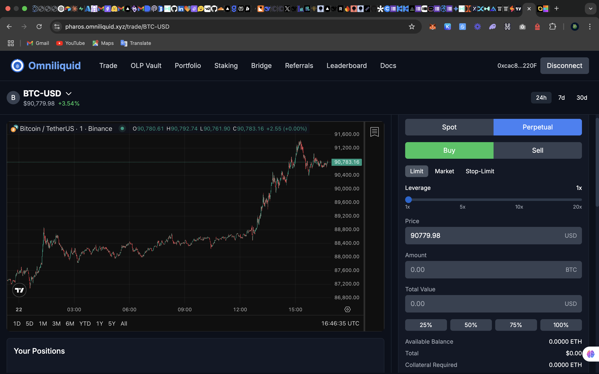
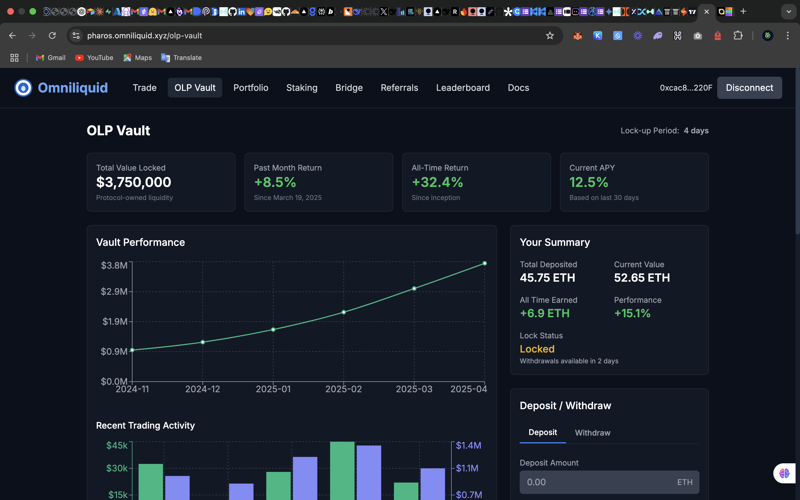
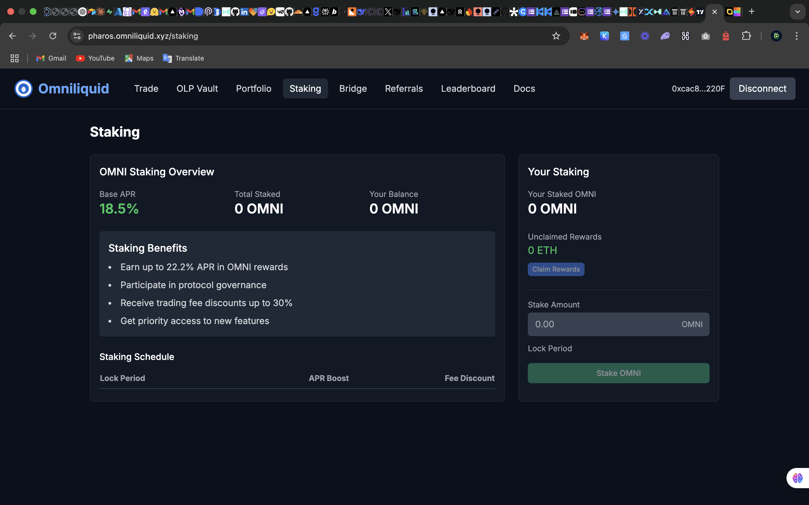

# Omniliquid



## Overview

Omniliquid is a fully decentralized trading platform built on Pharos, enabling spot and perpetual markets for a wide range of assets including cryptocurrencies, stocks, forex, bonds, ETFs, commodities, and other real-world assets (RWAs). It utilizes a 100% on-chain Central Limit Order Book (CLOB) model for transparent and efficient price discovery.

[](https://opensource.org/licenses/MIT)

## Table of Contents

- [Features](#features)
- [Technical Architecture](#technical-architecture)
  - [Core Components](#core-components)
  - [System Overview](#system-overview)
  - [Smart Contract Structure](#smart-contract-structure)
- [Directory Structure](#directory-structure)
- [Deployment](#deployment)
  - [Deployed Addresses](#deployed-addresses)
- [User Guide](#user-guide)
  - [Depositing Collateral](#depositing-collateral)
  - [OLP Vault](#olp-vault)
  - [Trading](#trading)
  - [Managing Positions](#managing-positions)
  - [Staking OMNI Tokens](#staking-omni-tokens)
- [Developer Guide](#developer-guide)
  - [Environment Setup](#environment-setup)
  - [Building the Project](#building-the-project)
  - [Testing](#testing)
  - [Oracle Integration](#oracle-integration)
  - [Custom Extensions](#custom-extensions)
- [API Reference](#api-reference)
- [Contributing](#contributing)
- [License](#license)

## Features

- **Multi-Asset Support**: Trade crypto, stocks, forex, commodities, and RWAs in a single platform
- **Spot & Perpetual Trading**: Both spot markets and perpetual futures with funding rates
- **On-Chain Order Book**: Fully transparent CLOB model with efficient matching
- **Cross-Margin Trading**: Efficient capital utilization across different positions
- **Advanced Risk Management**: Sophisticated liquidation and insurance systems
- **Synthetic Assets**: Trade synthetic versions of any asset without requiring custody
- **Staking & Governance**: OMNI token for platform governance and fee discounts
- **Oracle Integration**: Reliable price feeds via Supra Oracle

## Technical Architecture

### Core Components

Omniliquid's architecture consists of several key components that work together to provide a comprehensive trading platform:

1. **Asset Registry**: Manages supported assets and their metadata
2. **Collateral Manager**: Handles user deposits, withdrawals, and margin requirements
3. **Market & Position Manager**: Core trading engine and position lifecycle management
4. **Oracle System**: Price feeds with TWAP support via Supra Oracle integration
5. **Enhanced Orderbook**: On-chain order matching with various order types
6. **Funding Rate Manager**: Calculates and applies funding rates for perpetual markets
7. **Liquidation Engine**: Monitors and liquidates underwater positions
8. **Risk Management**: Enforces position limits and system-wide risk parameters
9. **TokenManager**: Synthetic asset issuance and management
10. **Fee System**: Trading fee calculation and distribution
11. **Insurance Fund**: Protection against socialized losses
12. **Governance**: Protocol parameter management via OMNI token voting

### System Overview

The system follows a modular design pattern where components have specific responsibilities and interact through well-defined interfaces:

- **User Layer**: Traders interact with Position Manager to open/close trades
- **Trading Layer**: Market and Order Book handle matching and execution
- **Settlement Layer**: Collateral Manager and TokenManager handle settlement
- **Risk Layer**: Liquidation Engine and Insurance Fund manage system risks
- **Infrastructure Layer**: Oracle, Security Module, and Asset Registry provide core services

### Smart Contract Structure

The smart contracts follow a pattern of clear specialiazations, with secure interactions between components:

- Core interfaces are defined for cross-contract communication
- Access control is enforced through the SecurityModule
- Economic security is maintained through the Insurance Fund
- All user balances and positions are stored on-chain for full transparency
- Multi-stage security checks prevent common DeFi vulnerabilities

## Directory Structure

```
omniliquid/
├── artifacts/                    # Compiled contract artifacts
├── cache/                        # Hardhat cache
├── contracts/                    # Smart contracts
│   ├── AssetRegistry.sol         # Asset management
│   ├── CollateralManager.sol     # Handles user collateral
│   ├── EnhancedOrderbook.sol     # On-chain order book
│   ├── FeeManager.sol            # Fee collection and distribution
│   ├── FundingRateManager.sol    # Perpetual funding rates
│   ├── Governance.sol            # Protocol governance
│   ├── LiquidationEngine.sol     # Position liquidations
│   ├── Market.sol                # Core trading engine
│   ├── OMNIStaking.sol           # Token staking
│   ├── OMNIToken.sol             # Governance token
│   ├── Oracle.sol                # Price feed integration
│   ├── OrderExecutor.sol         # Executes stop-loss/take-profit
│   ├── PositionManager.sol       # Position lifecycle
│   ├── TokenManager.sol          # Synthetic token handling
│   └── Vault.sol                 # Protocol treasury
├── ignition/                     # Deployment modules         # Updates oracle prices
│   └── modules
│       └── omniliquid.ts 
├── scripts/                      # Utility scripts
│   ├── oracleUpdater.js          # Updates oracle prices
│   └── testTradingScript.js      # Example trading script
├── test/                         # Test files
├── .env.example                  # Environment variables template
├── deployed_addresses.json       # Deployed contract addresses
├── hardhat.config.ts             # Hardhat configuration
├── package.json                  # Dependencies
└── README.md                     # This file
```

## Deployment

Omniliquid is deployed on Pharos Devnet. The deployment process uses Hardhat Ignition for deterministic and modular contract deployment.

### Deployed Addresses

The following contracts are deployed on Pharos Devnet:

| Contract                  | Address                                    |
|---------------------------|-------------------------------------------|
| AssetRegistry             | 0xb801d7b1aA715c9297cbd8De56756ad7eEC36Ae9 |
| SecurityModule            | 0x9FF18F397dF0f82CD2E6e75DD4fd53D3c9d0193C |
| FeeManager                | 0xd3897f06448bC86eed32a770176491dC79bf9681 |
| EventEmitter              | 0x9836477De479cc13244A921394757914F001e05B |
| InsuranceFund             | 0xBd38DeCff758C0402f5B0179ed75D686aAE5A4AE |
| Vault                     | 0xE1a2356e41609C5b05ff34451E3009AB12110Ba9 |
| Oracle                    | 0x09617ea48B07f3e1a57DEC4DF533214861f01cdf |
| TokenManager              | 0xF0cb7756c71c4365b3f6BeDD6b3bcDF2fa224A0D |
| ReferralProgram           | 0xa3DaEc4e031D392F20aBA9075736BB1b0C62b523 |
| CollateralManager         | 0x0f7cb0945C38e906E54EfF2D95C5A9e4e215DF73 |
| EnhancedOrderBook         | 0x970e7d74D8c629d7F892A49E8C24e356766E2EBf |
| FundingRateManager        | 0x0412d58eAbf6d14eA8991ef5157f95d4bf951aD7 |
| RiskManager               | 0xa255c78CE8Ec0139afFBb4F76dC6Da46F647483b |
| CrossMarginAccountManager | 0x7300c6c0eA253BC03bFAf8dB478C61d41b9c0141 |
| Market                    | 0x67dc7eBfabDe202B3837c95c4512Ad89B15cDC91 |
| ClearingHouse             | 0xdb42f6fe6906448485398Fd743b96bA89F27D7b6 |
| LiquidationEngine         | 0x97Fdc2c6D38bD6a8b964858a862671245E8BF4f2 |
| PositionManager           | 0x74D002cB263a1590A46cEC34f525ce2e33C27C05 |
| OrderExecutor             | 0x4BC6a7262c0B030fCaFE3119dA2211380473A9E1 |
| OMNIToken                 | 0x2e3ed7a1FbB37F82e2d8ae073606B16f1F2057fD |
| OMNIStaking               | 0xc84f7531cA7247fAA143fF12F4559F3413cb5a01 |
| FeeDistributor            | 0x5863964994Bd8376853619d510320f77E12E34Ba |

## User Guide

The Omniliquid platform is accessible at [https://pharos.omniliquid.xyz](https://pharos.omniliquid.xyz)

### Depositing Collateral

Before trading, users need to deposit collateral in ETH:

1. Connect your wallet to the Omniliquid interface at [https://pharos.omniliquid.xyz](https://pharos.omniliquid.xyz)
2. Navigate to the "Portfolio" section
3. Enter the amount of ETH you wish to deposit
4. Confirm the transaction in your wallet
5. Your collateral balance will be updated once the transaction is confirmed


### OLP Vault

The OLP (Omniliquidity Provider) Vault is a community-owned liquidity pool that powers Omniliquid's exchange, enabling users to earn returns from market making and liquidations.

#### What is the OLP Vault?

The OLP Vault allows any user to participate in providing liquidity to the protocol, democratizing access to market making rewards typically reserved for privileged parties on other exchanges. By depositing ETH into the vault, users:

- Contribute to the protocol's market making activities
- Support liquidation processes
- Enhance overall liquidity depth
- Earn a share of trading fees and protocol profits

#### Using the OLP Vault

1. Navigate to the OLP Vault page at [https://pharos.omniliquid.xyz/olp-vault](https://pharos.omniliquid.xyz/olp-vault)
2. Review current vault statistics including TVL, APY, and historical performance
3. Connect your wallet if you haven't already
4. Enter the amount of ETH you wish to deposit
5. Confirm the transaction in your wallet
6. Receive OLP tokens representing your share of the vault


*OLP Vault interface showing statistics and deposit options*

#### OLP Vault Features

- **4-Day Lockup Period**: After depositing, funds are locked for 4 days to ensure liquidity stability
- **Real-time Performance Tracking**: Monitor your earnings and vault performance
- **Proportional Rewards**: Earn returns based on your percentage share of the vault
- **Transparent Metrics**: View detailed statistics on vault activities and returns

When you're ready to withdraw:

1. Navigate to the OLP Vault page
2. Select "Withdraw" and enter the amount of OLP tokens to redeem
3. If the lockup period has passed, confirm the transaction to receive your ETH plus earnings
4. If still within lockup period, a warning will be displayed with the unlock time

### Trading

Visit the trading interface at [https://pharos.omniliquid.xyz/trade](https://pharos.omniliquid.xyz/trade) to access all trading functionality.


*Omniliquid's comprehensive trading interface*

#### Spot Trading

1. Select the asset you want to trade (e.g., BTC, XAU, TSLA)
2. Choose "Spot" trading mode
3. Enter the amount you want to trade
4. Select order type (Market, Limit, etc.)
5. For limit orders, set your desired price
6. Click "Buy" or "Sell" to place your order
7. Confirm the transaction in your wallet


#### Perpetual Trading

1. Select the asset with "-PERP" suffix (e.g., BTC-PERP)
2. Choose your leverage (1x-20x)
3. Enter the position size
4. Select long or short direction
5. Choose order type and set price if needed
6. Add optional stop-loss or take-profit levels
7. Click "Submit" and confirm the transaction

### Managing Positions

1. View your open positions in the "Positions" tab
2. Monitor PnL, liquidation prices, and funding payments
3. To modify a position:
   - Increase/decrease position size
   - Add/modify stop-loss or take-profit orders
   - Add more collateral if needed
4. To close a position:
   - Click "Close" on the specific position
   - Choose full or partial closure
   - Confirm the transaction

### Staking OMNI Tokens

1. Acquire OMNI tokens through trading or external exchanges
2. Navigate to the "Staking" section at [https://pharos.omniliquid.xyz/staking](https://pharos.omniliquid.xyz/staking)
3. Choose your staking duration (longer durations offer higher rewards)
4. Enter the amount of OMNI to stake
5. Confirm the transaction
6. Track your staking rewards in real-time
7. Claim rewards anytime, but tokens remain locked for the selected duration


*OMNI staking interface*

## Developer Guide

### Environment Setup

1. Clone the repository:
   ```bash
   git clone https://github.com/omniliquidx/evm-contracts.git
   cd omniliquid
   ```

2. Install dependencies:
   ```bash
   npm install
   ```

3. Create a `.env` file based on `.env.example`:
   ```bash
   cp .env.example .env
   ```

4. Update the `.env` file with your private key and RPC URLs:
   ```
   PRIVATE_KEY=your_private_key
   RPC_URL=https://pharos-rpc.dplabs-internal.com
   ```

### Building the Project

Compile the smart contracts:
```bash
npx hardhat compile
```

### Testing

Run the test suite:
```bash
npx hardhat test
```

For specific test files:
```bash
npx hardhat test test/Market.test.js
```

### Deploying

Deploy using Hardhat Ignition:
```bash
npx hardhat ignition deploy ./ignition/omniliquid.ts --network pharosDevnet
```

### Oracle Integration

The system integrates with Supra Oracle for price feeds. To update prices manually:

1. Configure your oracle API key in `.env`
2. Run the oracle updater script:
   ```bash
   node scripts/oracleUpdater.js
   ```

For production environments, set up a cron job to run the updater regularly.

### Custom Extensions

#### Adding New Assets

To add a new synthetic asset:

1. Update `AssetRegistry.sol` to include the new asset
2. Add price feed in the Oracle contract
3. Configure risk parameters in `RiskManager.sol`
4. Create market in `Market.sol`

Example code in a deployment script:
```javascript
// Register a new asset
await assetRegistry.registerAsset(
  "AAPL", // Symbol
  "AAPL/USD", // Oracle feed key
  8 // Decimals
);

// Configure oracle
await oracle.setPairMapping("AAPL/USD", 6000);

// Add markets
await market.addMarket(
  "AAPL",    // Spot market
  0,         // Market type (0 = spot)
  10,        // Max leverage
  ethers.parseEther("1000"),  // Max position size
  5,         // Taker fee (0.05%)
  1,         // Maker fee (0.01%)
  ethers.parseEther("0.001")  // Min order size
);
```

#### Implementing Custom Order Types

To add a new order type:

1. Extend the `EnhancedOrderbook.sol` contract
2. Add the new order type to the `OrderType` enum
3. Implement order matching logic
4. Update the UI to support the new order type

## API Reference

### Core Interfaces

#### Position Management

```solidity
function openLeveragedPosition(
    string calldata asset,
    uint128 collateralAmount,
    uint256 leverage,
    bool isLong
) external returns (uint256);

function closePosition(uint256 positionId) external;

function addStopLoss(uint256 positionId, uint128 stopLossPrice) external returns (uint256);

function addTakeProfit(uint256 positionId, uint128 takeProfitPrice) external returns (uint256);
```

#### Collateral Management

```solidity
function depositCollateral() external payable;

function withdrawCollateral(uint256 amount) external;
```

#### Market Data

```solidity
function getPositionDetails(uint256 positionId) external view returns (
    address trader,
    string memory asset,
    uint128 amount,
    uint128 entryPrice,
    bool isLong,
    bool isOpen
);

function getOpenInterest(string calldata asset) external view returns (uint256 longOI, uint256 shortOI);

function getBestBid(string calldata asset) external view returns (uint128 price, uint128 available);

function getBestAsk(string calldata asset) external view returns (uint128 price, uint128 available);
```

## Contributing

We welcome contributions to Omniliquid! Here's how you can contribute:

1. Fork the repository
2. Create a feature branch: `git checkout -b feature/your-feature-name`
3. Commit your changes: `git commit -m 'Add some feature'`
4. Push to the branch: `git push origin feature/your-feature-name`
5. Open a Pull Request

Please ensure your code follows our style guidelines and includes appropriate tests.

## License

This project is licensed under the MIT License - see the LICENSE file for details.